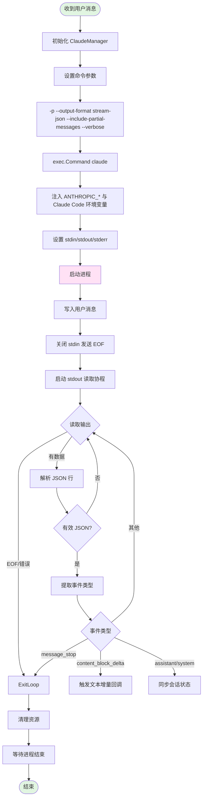
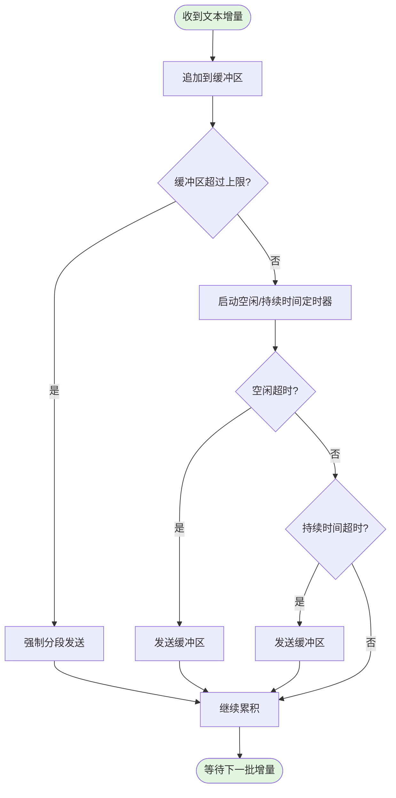

# 飞书机器人详细流程图补充

本文档补充当前实现的关键流程：Claude CLI 启动、流式分段发送、命令处理与会话管理。

## 1. Claude CLI 启动与管理流程



## 2. 流式分段发送流程



**分段触发条件**：
- `StreamIdleTimeout`：空闲一段时间后发送
- `StreamMaxDuration`：持续输出超过阈值后发送
- `StreamMaxBufferSize`：缓冲区超过最大字符数时发送

## 3. 消息解析与命令处理流程

```mermaid
flowchart TD
    Start([收到飞书事件]) --> ParseEvent[解析事件结构]
    ParseEvent --> CheckType{事件类型?}

    CheckType -->|非消息事件| Ignore1([忽略])
    CheckType -->|im.message.receive_v1| ExtractMsg[提取消息内容]

    ExtractMsg --> ParseContent[解析 content JSON]
    ParseContent --> ContentCheck{内容格式?}

    ContentCheck -->|非 text 类型| Ignore2([忽略])
    ContentCheck -->|text 类型| ExtractText[提取文本]

    ExtractText --> ChatType{chat_type?}

    ChatType -->|p2p| P2PMode[P2P处理]
    ChatType -->|group/private| GroupMode[群聊处理]

    GroupMode --> Mention{是否@机器人?}
    Mention -->|否| ToClaude[直接转发给 Claude]
    Mention -->|是| CommandCheck{是否命令?}

    CommandCheck -->|是| CommandHandle[执行 ls/bind/help]
    CommandCheck -->|否| StripMention[移除@前缀]
    StripMention --> ToClaude

    P2PMode --> ToClaude
    ToClaude --> End([进入流式对话流程])

    style Start fill:#e1f5e1
    style End fill:#e1f5e1
```

## 4. 会话管理与恢复

- **P2P**：按用户 `open_id/union_id` 维护会话，重复对话会使用 `--resume`。
- **群聊**：使用全局会话 ID（`global_group_session`），所有群聊共享上下文。
- **恢复失败**：若 CLI 返回 "No conversation found"，会自动重试一次（不带 `--resume`）。

## 5. 绑定配置与基础目录

- 绑定关系存储在 `configs/chat_config.json`。
- `BASE_DIR` 或配置文件中的 `base_dir` 决定 `ls/bind` 的扫描目录。
- `bind <序号>` 将群聊绑定到对应项目路径，后续 Claude CLI 在该目录下运行。
