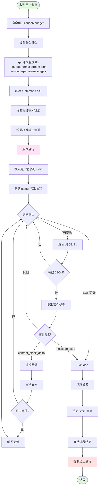
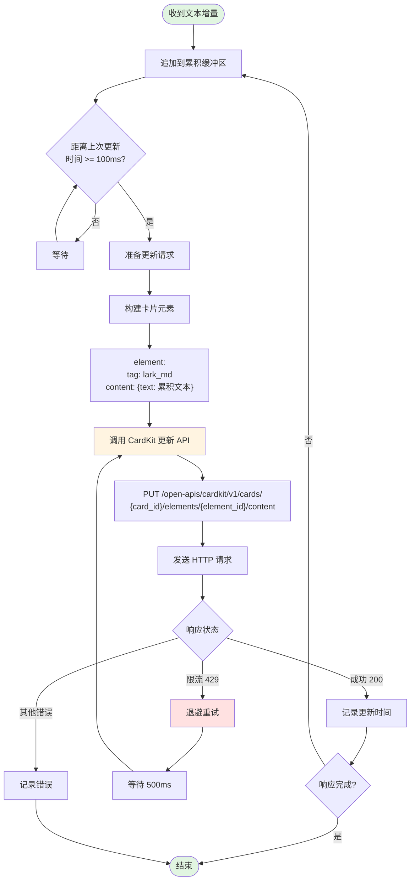
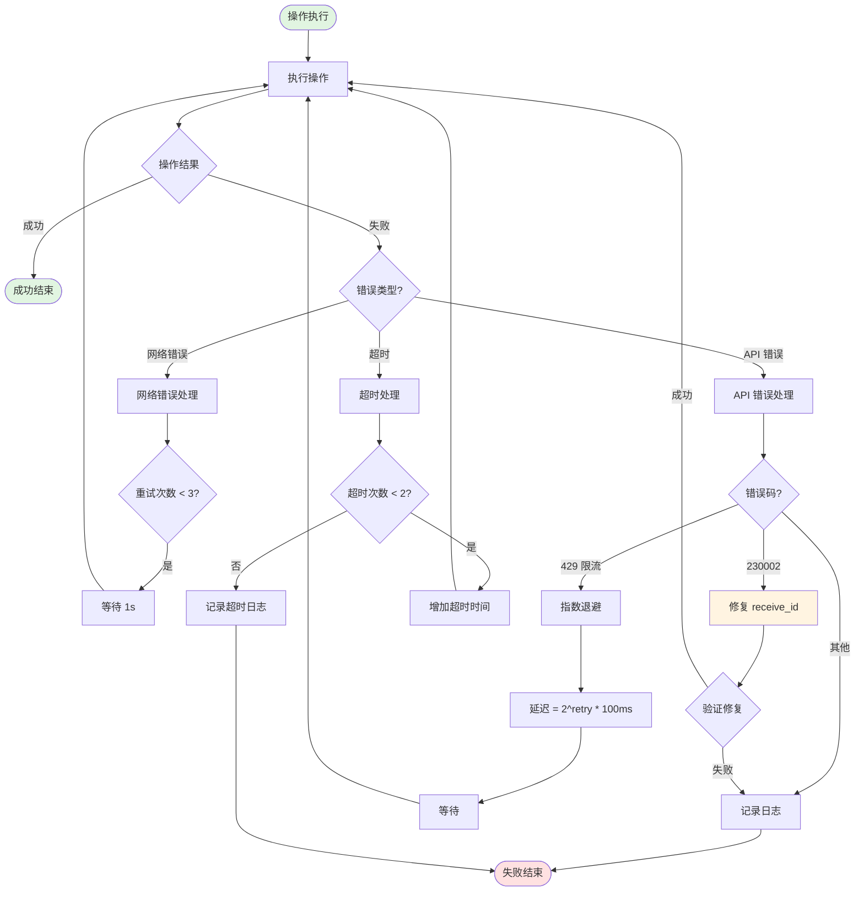
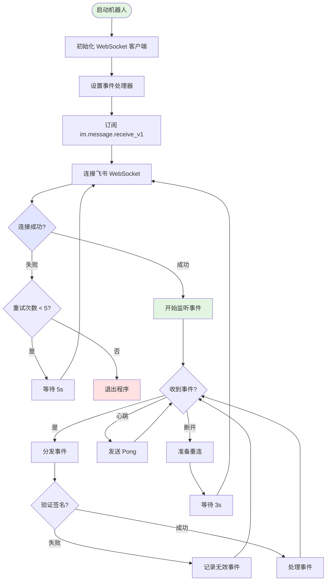
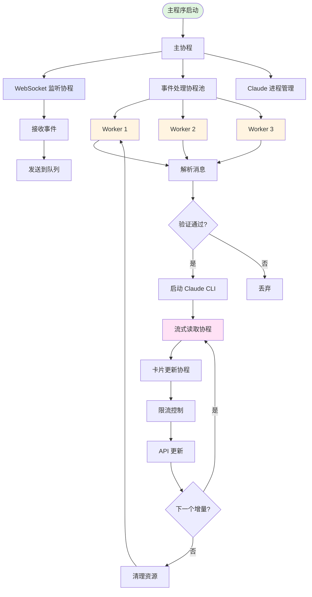
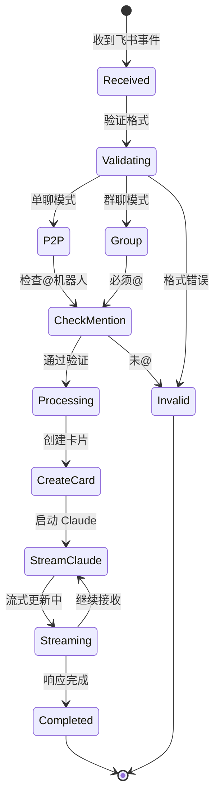
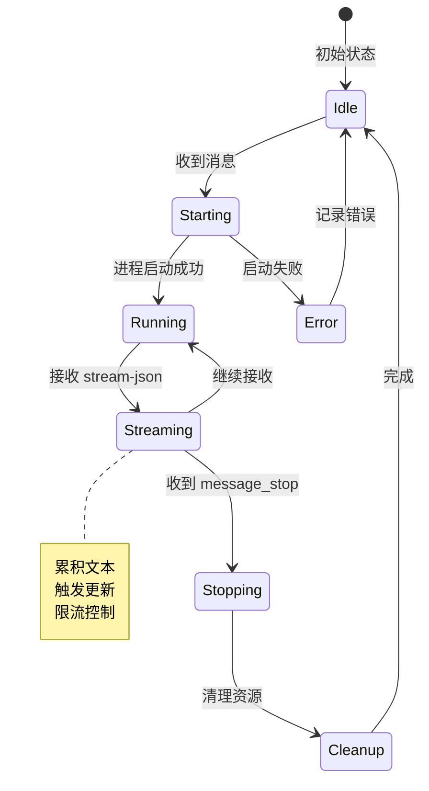
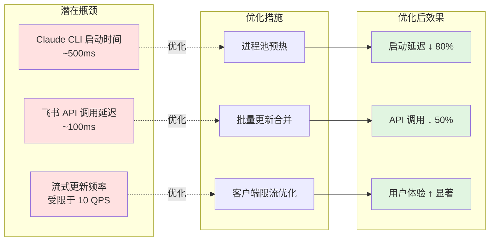
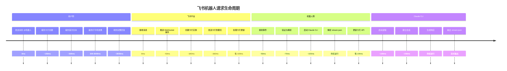

# 飞书机器人详细流程图补充

## 1. Claude CLI 启动与管理流程



## 2. CardKit 流式更新详细流程



## 3. 消息解析与验证流程

```mermaid
flowchart TD
    Start([收到飞书事件]) --> ParseEvent[解析事件结构]
    ParseEvent --> CheckType{事件类型?}

    CheckType -->|非消息事件| Ignore1([忽略])
    CheckType -->|im.message.receive_v1| ExtractMsg[提取消息内容]

    ExtractMsg --> ParseContent[解析 content JSON]
    ParseContent --> ContentCheck{内容格式?}

    ContentCheck -->|非 text 类型| Ignore2([忽略])
    ContentCheck -->|text 类型| ExtractText[提取文本]

    ExtractText --> CheckChat{Chat 字段?}

    CheckChat -->|有值| GroupMode[群聊模式]
    CheckChat -->|无值| P2PMode[单聊模式]

    GroupMode --> ExtractChatID[提取 chat_id]
    ExtractChatID --> ValidateMention{是否@机器人?}

    ValidateMention -->|否| Ignore3([忽略])
    ValidateMention -->|是| GroupSuccess[群聊处理成功]

    P2PMode --> ExtractOpenID[提取 open_id]
    ExtractOpenID --> P2PSuccess[单聊处理成功]

    GroupSuccess --> SetParams["receive_id_type=chat_id<br/>receive_id=群聊ID"]
    P2PSuccess --> SetParams2["receive_id_type=open_id<br/>receive_id=用户open_id"]

    SetParams --> Next[进入消息处理流程]
    SetParams2 --> Next

    style Start fill:#e1f5e1
    style Ignore1 fill:#ffe1e1
    style Ignore2 fill:#ffe1e1
    style Ignore3 fill:#ffe1e1
    style GroupSuccess fill:#e1e5ff
    style P2PSuccess fill:#e1e5ff
    style Next fill:#e1f5e1
```

## 4. 错误处理与重试机制



## 5. WebSocket 连接管理流程



## 6. 数据结构与消息流

```mermaid
graph LR
    subgraph 飞书事件
        A1[im.message.receive_v1]
        A2[event.sender.sender_id.open_id]
        A3[event.chat.id]
        A4[event.message.content]
    end

    subgraph 解析层
        B1[消息类型判断]
        B2[@机器人检测]
        B3[文本提取]
    end

    subgraph 处理层
        C1[receive_id]
        C2[receive_id_type]
        C3[用户消息]
    end

    subgraph Claude层
        D1[cc1 进程]
        D2[stream-json 输出]
        D3[文本增量]
    end

    subgraph CardKit层
        E1[card_id]
        E2[element_id]
        E3[更新 API]
    end

    A1 --> B1
    A2 --> B1
    A3 --> B1
    A4 --> B3

    B1 --> C1
    B2 --> C2
    B3 --> C3

    C3 --> D1
    D1 --> D2
    D2 --> D3

    D3 --> E3
    E3 --> E1
    E3 --> E2

    style A1 fill:#e1e5ff
    style D1 fill:#ffe1f5
    style E3 fill:#fff4e1
```

## 7. 并发模型与协程管理



## 8. 关键状态机

### 8.1 消息处理状态机



### 8.2 Claude CLI 状态机



## 9. 性能瓶颈与优化点



## 10. 完整的请求生命周期


