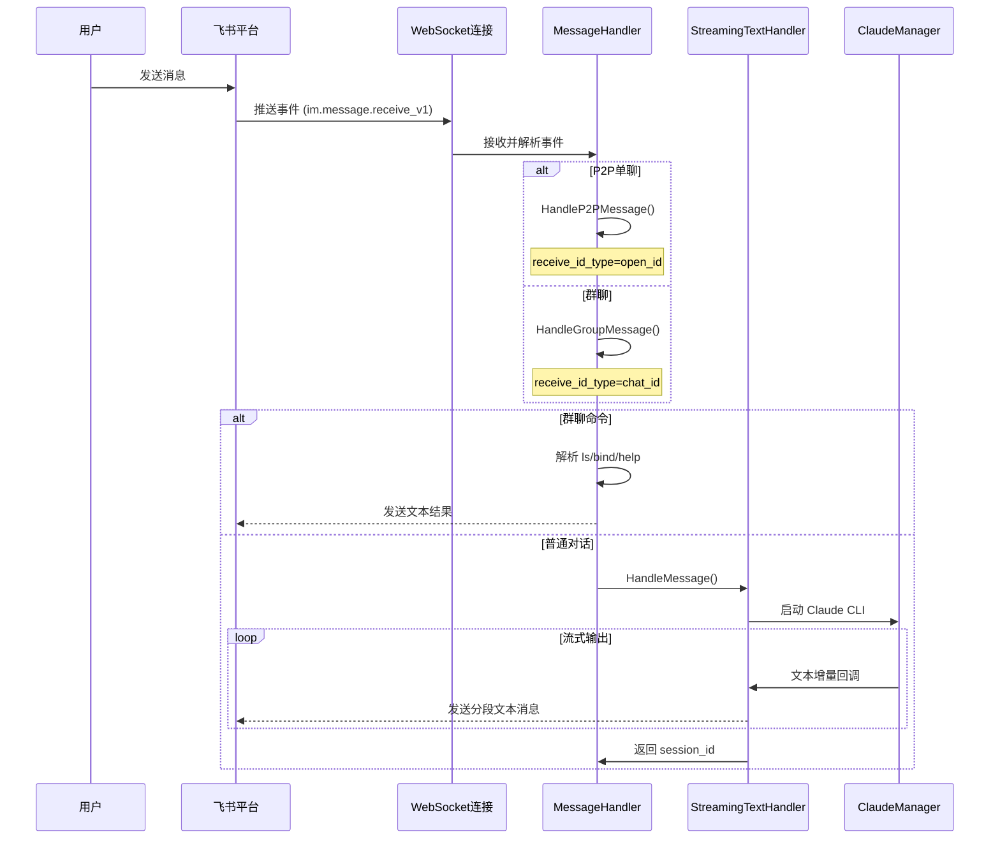
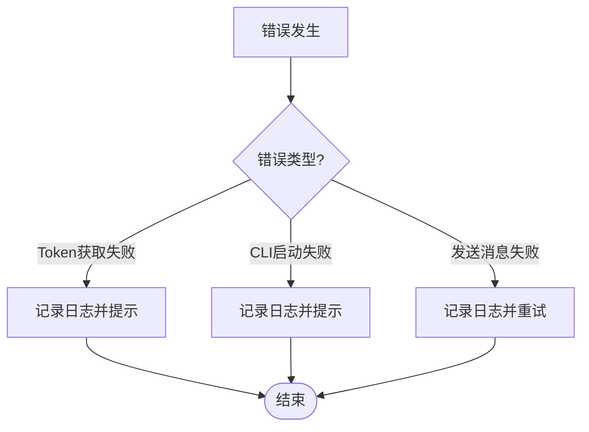

# 飞书机器人核心流程图

## 系统架构流程图

```mermaid
flowchart TD
    Start([用户发送消息]) --> WS[飞书 WebSocket 推送]
    WS --> Parse[事件解析器]
    Parse --> Type{chat_type?}

    Type -->|p2p| P2P[P2P消息处理器]
    Type -->|group/private| Group[群聊消息处理器]

    P2P --> ExtractP2P[提取文本内容]
    Group --> Mention{是否@机器人?}

    Mention -->|否| ExtractGroup[提取文本内容]
    Mention -->|是| CmdCheck{是否命令?}

    CmdCheck -->|ls/bind/help| CmdHandle[执行指令并回复文本]
    CmdCheck -->|否| StripMention[移除@前缀]

    ExtractP2P --> Stream[流式对话处理]
    ExtractGroup --> Stream
    StripMention --> Stream

    Stream --> StartClaude[启动 Claude CLI]
    StartClaude --> ParseStream[解析 stream-json]
    ParseStream --> Buffer[增量缓存]

    Buffer --> Segment{空闲/超时/超限?}
    Segment -->|是| SendText[发送文本消息]
    Segment -->|否| ParseStream
    SendText --> ParseStream

    ParseStream --> SaveSession[保存会话ID]
    SaveSession --> End([流程结束])

    CmdHandle --> End

    style Start fill:#e1f5e1
    style End fill:#e1f5e1
    style P2P fill:#e1e5ff
    style Group fill:#e1e5ff
    style StartClaude fill:#ffe1f5
    style SendText fill:#fff4e1
```

## 核心组件交互时序图



## 关键决策点

### 1. 消息类型判断

| 判断条件 | 处理路径 | receive_id_type | receive_id |
|---------|---------|-----------------|------------|
| `chat_type == "p2p"` | P2P单聊 | `open_id` | 用户 open_id |
| `chat_type == "group"` 或 `private` | 群聊 | `chat_id` | 群聊 ID |

### 2. 群聊命令触发

- **命令触发**：仅在群聊中 `@机器人` 且识别为 `ls/bind/help` 才执行命令
- **普通对话**：无论是否 @，都会转发给 Claude CLI

### 3. Stream-JSON 事件处理

```go
// 主要处理 content_block_delta 事件
case "content_block_delta":
    handleContentBlockDelta(event)
```

### 4. 分段发送策略

分段由 `internal/utils/timeout.go` 统一管理：
- 空闲超时（StreamIdleTimeout）
- 最大持续时间（StreamMaxDuration）
- 最大缓冲区（StreamMaxBufferSize）

## 错误处理流程



## 性能指标

| 指标 | 值 | 说明 |
|------|-----|------|
| WebSocket连接 | 1个 | 长连接，自动重连 |
| 文本消息发送 | 2-5 次/对话（视长度） | 由分段策略控制 |
| Claude CLI 进程 | 按需启动 | 每条消息一个进程 |
| 流式延迟 | 由 `StreamIdleTimeout` 控制 | 默认 8s 空闲发送 |

## 文件映射

| 流程步骤 | 对应文件 |
|---------|---------|
| WebSocket连接 | `cmd/bot/main.go` |
| 消息处理 | `internal/bot/handlers/message.go` |
| P2P处理 | `internal/bot/handlers/message.go` |
| 群聊处理 | `internal/bot/handlers/message.go` |
| CLI管理 | `internal/claude/manager.go` |
| 流式分段发送 | `internal/claude/streaming_text_handler.go` |
| 绑定配置 | `internal/config/chat_config.go` |
