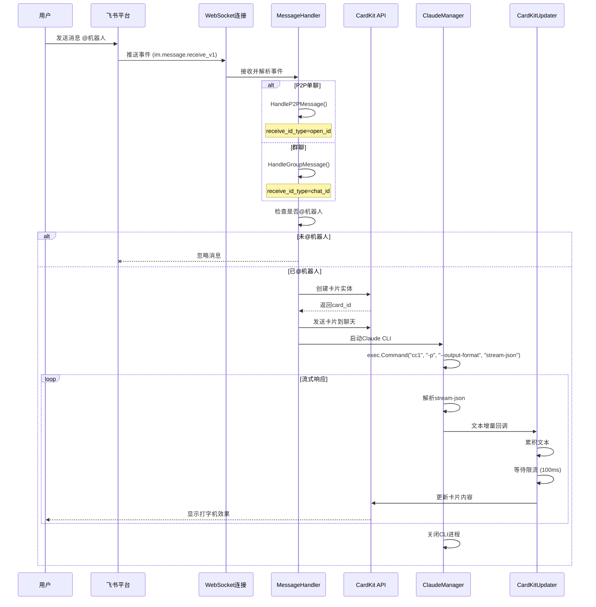
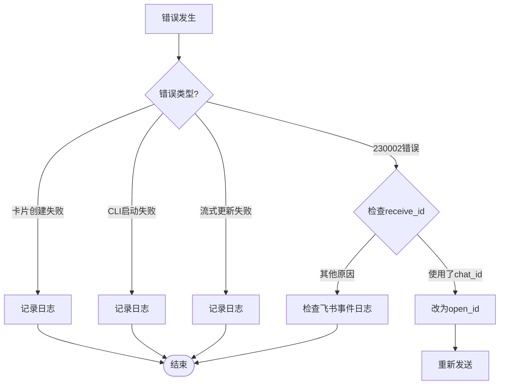

# 飞书机器人核心流程图

## 系统架构流程图

```mermaid
flowchart TD
    Start([用户发送消息 @机器人]) --> WS[飞书 WebSocket 推送]
    WS --> Parse[事件解析器]
    Parse --> Type{消息类型?}

    Type -->|P2P单聊| P2P[P2P消息处理器]
    Type -->|群聊| Group[群聊消息处理器]

    P2P --> Validate{安全检查}
    Group --> Validate

    Validate -->|未@机器人| End1([结束])
    Validate -->|已@机器人| Extract[提取用户ID和消息内容]

    Extract --> CreateCard[创建CardKit卡片]
    CreateCard --> CardAPI[调用飞书卡片API]
    CardAPI --> CardCreated{卡片创建成功?}

    CardCreated -->|失败| Error[记录错误日志]
    CardCreated -->|成功| SendMsg[发送卡片到聊天]

    SendMsg --> StartClaude[启动Claude CLI进程]
    StartClaude --> ClaudeCmd[执行: cc1 -p --output-format stream-json]

    ClaudeCmd --> StreamParser[Stream-JSON解析器]
    StreamParser --> ParseLoop{解析输出流}

    ParseLoop -->|收到事件| EventType{事件类型}

    EventType -->|content_block_delta| ExtractText[提取文本增量]
    EventType -->|其他事件| Discard[忽略]

    ExtractText --> Accumulate[累积文本]
    Accumulate --> RateLimiter[限流器 100ms]
    RateLimiter --> UpdateCard[调用CardKit更新API]

    UpdateCard --> UpdateLoop{还有增量?}
    UpdateLoop -->|是| ParseLoop
    UpdateLoop -->|否| Complete[Claude响应完成]

    Complete --> CloseCLI[关闭Claude CLI进程]
    CloseCLI --> End2([流程结束])

    Error --> End2

    style Start fill:#e1f5e1
    style End1 fill:#ffe1e1
    style End2 fill:#e1f5e1
    style P2P fill:#e1e5ff
    style Group fill:#e1e5ff
    style CreateCard fill:#fff4e1
    style StartClaude fill:#ffe1f5
    style UpdateCard fill:#ffe1f5
```

## 核心组件交互时序图



## 关键决策点

### 1. 消息类型判断

| 判断条件 | 处理路径 | receive_id_type | receive_id |
|---------|---------|-----------------|------------|
| `event.Event.Chat != nil` | 群聊消息 | `chat_id` | 群聊ID |
| `event.Event.Chat == nil` | P2P单聊 | `open_id` | 用户open_id |

### 2. @机器人检查

- **群聊**：必须 `@机器人`
- **单聊**：直接触发（无需@）

### 3. Stream-JSON 事件过滤

```go
// 只处理 content_block_delta 事件
if eventType != "content_block_delta" {
    continue // 忽略其他事件
}
```

### 4. 限流控制

```
100ms/次 = 10 QPS (飞书CardKit API限制)
```

## 错误处理流程



## 性能指标

| 指标 | 值 | 说明 |
|------|-----|------|
| WebSocket连接 | 1个 | 长连接，自动重连 |
| CardKit限流 | 10 QPS | 100ms间隔 |
| Claude CLI进程 | 按需启动 | 每个消息一个进程 |
| 流式延迟 | ~100ms | 用户感知延迟 |

## 文件映射

| 流程步骤 | 对应文件 |
|---------|---------|
| WebSocket连接 | `cmd/bot/main.go:50-60` |
| 消息处理 | `internal/bot/handlers/message.go:78-150` |
| P2P处理 | `message.go:78-82` |
| 群聊处理 | `message.go:144-148` |
| 卡片创建 | `internal/claude/handler.go:45-90` |
| CLI管理 | `internal/claude/manager.go:40-85` |
| 流式更新 | `internal/claude/cardkit_updater.go:35-70` |
